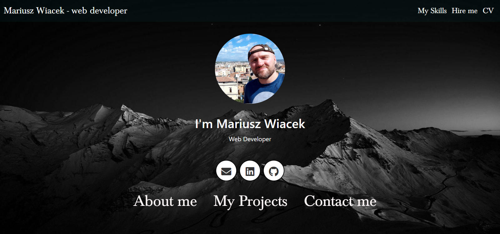

# 
**Portfolio**

 
  ## Table of Contents
  * [Description](#description)
  * [Languages](#languages)
  * [Installation Instructions](#installation)
  * [Screenshot](#Screenshot)
  * [License](#license)
  * [Contact Me](#Contact-me)
  
  ## Description
  
 Personal REACT Portfolio which covers most important sections(about, skills, projects) and downloadable CV.
 
 ## Languages and technlogies
 
  * Javascript
  * HTML
  * CSS
  * Bootstrap 
  * node.js
  * REACT

## Installation

Just click on deployed website link => https://mariuszwiacek.github.io/Portfolio/

This REACT page deployed in npm using gh-pages - https://github.com/gitname/react-gh-pages

    
### Screenshot

# License
   
  * Link: https://opensource.org/licenses/MIT
  ### Contact me
  * Profile: https://github.com/MariuszWiacek
